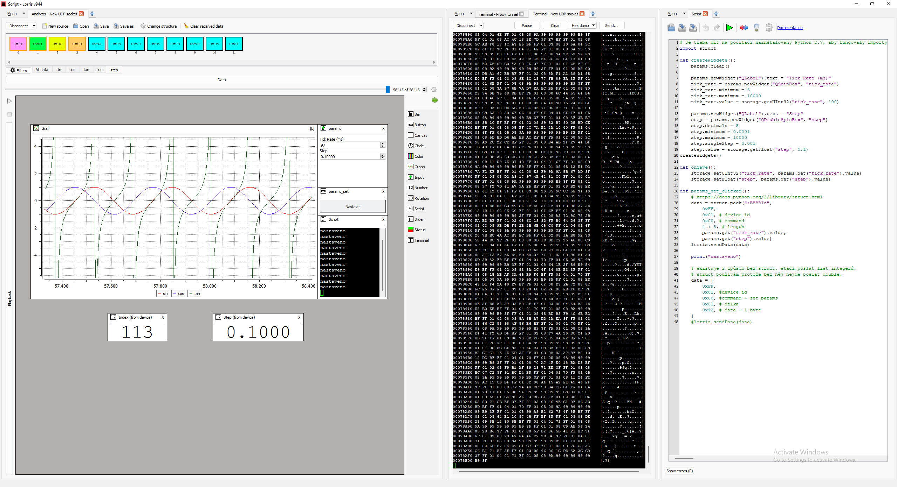
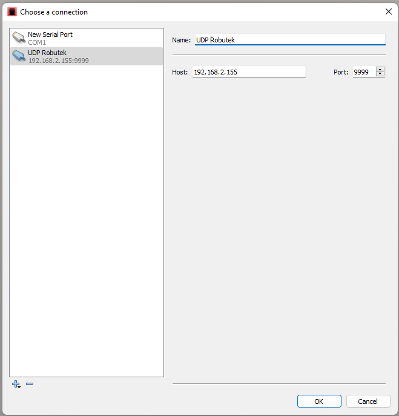
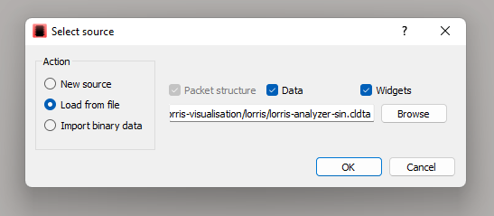

# Jaculus-Lorris-visualisation

ESP32 JavaScript interpreter connected to PC visualization software via UDP for real-time sensor data display.

This is proof-of-concept connection between Jaculus JS interpreter on ESP32 and Lorris visualisation software running on PC. It allows to configure binary based protocol and send data from ESP32 to Lorris for visualisation.

The communication is done over UDP protocol. The ESP32 sends packets with data to Lorris, which interprets them and visualises accordingly.

## Jaculus side

To simplify the packet creation, there is a `lorris-packet.ts` file which contains `Packet` and `PacketParser` classes. Follow the example to see how to create and parse packets.

## Lorris side

https://tasssadar.github.io/Lorris/cz/index.html

To connect Lorris to Jaculus, you need to prepare Terminal, choose connection type "UDP" and input host and port from Jaculus terminal output. Default port is `9999`.

Each communication -> sending data from Jaculus to Lorris has to be initiated by Lorris. Go the terminal and send any string (character key is enough). Then Jaculus gets the computer's address and port and can send data to it.

Open Lorris Analyser window, select same terminal and select template source from folder `lorris`. This will load preconfigured packet parsers and some basic visualisations.

